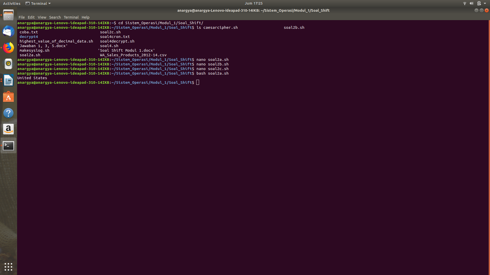

# SoalShift_modul1_E13
Jawaban Soal Shift Modul 1 Sistem Operasi

1. Anda diminta tolong oleh teman anda untuk mengembalikan filenya yang telah dienkripsi oleh seseorang menggunakan bash script, file yang dimaksud adalah nature.zip. Karena terlalu mudah kalian memberikan syarat akan membuka seluruh file tersebut jika pukul 14:14 pada tanggal 14 Februari atau hari tersebut adalah hari jumat pada bulan Februari.
Hint: Base64, Hexdump

   Jawab:

   

   `#!/bin/bash` adalah untuk menandakan bahwa kita bisa menjalankan file tersebut dengan perintah bash.
   
   Gambar = `ls | grep “[.]jpg$”` adalah untuk memasukkan isi dari folder yang sama dengan bash script ini, dalam hal ini foto foto, ke dalam variabel gambar.
   
   Selanjutnya kita menggunakan loop for untuk mengencode semua gambar dengan menggunakan base64 lalu filenya kita buat baru dengan tambahan “jadi” didepan nama file.
   
   Untuk pengaturan waktunya kita menggunakan crontab
   
   
   
   Saat dijalankan maka foto-foto yang diminta sudah dapat diakses sesuai waktu yang diminta pada soal.

2. Anda merupakan pegawai magang pada sebuah perusahaan retail, dan anda diminta untuk memberikan laporan berdasarkan file WA_Sales_Products_2012-14.csv. Laporan yang diminta berupa:
   - Tentukan negara dengan penjualan(quantity) terbanyak pada tahun 2012.
   
     Jawab:
     ```
     #!/bin/bash
   
     awk -F, '$7 ~ 2012 {arr[$1] += $10} END { for(i in arr) print i "," arr[i] }' WA_Sales_Products_2012-14.csv | sort -t',' -gk2,2 | awk -F',' '{print $1}' | tail -n1   
     ```
     Pertama, deklarasikan bahwa tipe file adalah bash script `#!/bin/bash`.
     
     Lalu data dimasukkan ke `awk` dengan `-F,` yang berarti fungsi awk ini menggunakan tanda koma sebagai pemisah field.
     
     Dan diikuti pencarian pola dimana `$7` (tahun) adalah `~ 2012` artinya $7 mengandung 2012 di dalamnya.
     
     Dari pola tersebut, dilakukan command `{arr[$1] += $10}` artinya untuk setiap pola yang ditemui dibuat array dengan index adalah nama kota dan isinya quantity (hal ini digunakan untuk menjumlahkan quantity pada setiap kota berdasarkan nama kota).
     
     Pada bagian `END` dalam awk, akan dilakukan perulangan untuk menampilkan array dan hasilnya yang langsung dimasukkan ke `sort` untuk diurutkan berdasarkan kolom 2 yaitu quantity dan hasil itu berikutnya akan diambil 1 terbawah (yang quantity paling besar) dengan `tail -n1`.
     
     Dan hasilnya adalah United States.
     
     
     
   - Tentukan tiga product line yang memberikan penjualan(quantity) terbanyak pada soal poin a.
   
     Jawab:
     ```
     #!/bin/bash
     awk -F',' '$1 == "United States" && $7 ~ 2012 {arr[$4] += $10} END {for(i in arr) print i "," arr[i]}' WA_Sales_Products_2012-14.csv | sort -t, -grk2,2 | awk -F, '{print $1}' | head -n3   
     ```
     Pertama, berdasarkan poin a jawabannya sudah diketahui (United States), maka langsung saja dilakukan `awk` untuk menyeleksi data yang hanya mengandung 'United States' dan '2012', dan disimpan di array untuk dihitung quantity nya seperti poin a (ini sekaligus untuk membuang field-filed yang tidak diperlukan).
     
     Hasil dari print array tersebut dimasukkan ke `sort` untuk mengurutkan data pada kolom 2 (quantity) secara reverse dengan `-grk2,2`.
     
     Hasil tadi dimasukkan lagi ke dalam `awk` untuk ditampilkan hanya `$1` (*product_line*) saja.
     
     Terakhir dimasukkan ke dalam `head -n3` untuk mengambil 3 data teratas.
     
     
     
   - Tentukan tiga product yang memberikan penjualan(quantity) terbanyak berdasarkan tiga product line yang didapatkan pada soal poin b.
   
     Jawab:
     ```
     #!/bin/bash
     awk -F, '$7 ~ 2012 && $1 == "United States" && ($4 == "Personal Accessories" || $4 == "Camping Equipment" || $4 == "Outdoor Protection") {arr[$6] += $10} END {for(i in arr) print i "," arr[i]}' WA_Sales_Products_2012-14.csv | sort -t',' -grk2,2 | awk -F, '{print $1}' | head -n3   
     ```
     Pertama, data langsung diseleksi berdasarkan tahun `$7 ~ 2012`, negara `$1 == "United States"`, dan yang mengandung ketiga dari product_line `$4 == "Personal Accessories" || $4 == "Camping Equipment" || $4 == "Outdoor Protection"` (jadi di data kali ini dipilih berdasarkan hasil dari poin b dan hasil dari poin a dan soal dari poin a).
     
     Dari data tersebut dimasukkan ke array dengan index `$6` yaitu product dengan isi jumlah quantity berdasarkan product yang telah diseleksi tersebut.
     
     Setelah itu, cara masih sama, yaitu `sort` menurut kolom ke 2 secara descending, dan hasil sort dimasukkan lagi ke `awk` untuk diprint productnya saja.
     
     Dan dimasukkan ke `head -n3` untuk diambil 3 data teratas.
     
     
  
3. Buatlah sebuah script bash yang dapat menghasilkan password secara acak sebanyak 12 karakter yang terdapat huruf besar, huruf kecil, dan angka. Password acak tersebut disimpan pada file berekstensi .txt dengan ketentuan pemberian nama sebagai berikut:
   - Jika tidak ditemukan file password1.txt maka password acak tersebut disimpan pada file bernama password1.txt
   - Jika file password1.txt sudah ada maka password acak baru akan disimpan pada file bernama password2.txt dan begitu seterusnya.
   - Urutan nama file tidak boleh ada yang terlewatkan meski filenya dihapus.
   - Password yang dihasilkan tidak boleh sama.
   
   Jawab:
   
   
   
   Pertama kita meminta input dari user untuk seberapa banyak user mau merandom password.
   
   Lalu perulangan `for` yang dipakai bertujuan untuk melakukan sebanyak user mau.
   
   Dalam `for` kita menemukan `if`, if disini berguna untuk mengecek apakah file yang dicari ada atau tidak, jika sudah ada maka perulangan akan berlanjut.
   
   Jika tidak ditemukan akan masuk ke `else`, dimana else disini akan merandom dari `A-Z`, `a-z`, dan `0-9` sebanyak 12 karakter dan dipakai untuk nama file password ke i sesuai dengan loop tadi.
   
   Lalu diakhir ditambahkan echo untuk mempercantik.

4. Lakukan backup file syslog setiap jam dengan format nama file “jam:menit tanggal-bulan-tahun”. Isi dari file backup terenkripsi dengan konversi huruf (string manipulation) yang disesuaikan dengan jam dilakukannya backup misalkan sebagai berikut:
   - Huruf b adalah alfabet kedua, sedangkan saat ini waktu menunjukkan pukul 12, sehingga huruf b diganti dengan huruf alfabet yang memiliki urutan ke 12+2 = 14.
   - Hasilnya huruf b menjadi huruf n karena huruf n adalah huruf ke empat belas, dan seterusnya. 
   - setelah huruf z akan kembali ke huruf a
   - Backup file syslog setiap jam.
   - dan buatkan juga bash script untuk dekripsinya.
   
   Jawab:
   ```
   #!/bin/bash
   
   jam=`date +%H`
   menit=`date +%M`
   tanggal=`date +%d`
   bulan=`date +%m`
   tahun=`date +%Y`
   filename="$jam:$menit $tanggal-$bulan-$tahun"

   cipher1lower=`expr $jam + 97`
   cipher2lower=`expr $jam + 97 - 1`

   cipher1upper=`expr $jam + 65`
   cipher2upper=`expr $jam + 65 - 1`

   charcipher1lower="\\$(printf '%03o' $cipher1lower)"
   charcipher2lower="\\$(printf '%03o' $cipher2lower)"

   charcipher1upper="\\$(printf '%03o' $cipher1upper)"
   charcipher2upper="\\$(printf '%03o' $cipher2upper)"

   patternlower=$charcipher1lower"-za-"$charcipher2lower
   patternupper=$charcipher1upper"-ZA-"$charcipher2upper

   cat /var/log/syslog | tr [A-Za-z] [$patternupper$patternlower] > "/var/log/backup/$filename"   

   ```
   Dari sini, pertama deklarasikan tipe bash script `#!/bin/bash`.
   
   Lalu buat judul untuk file berdasarkan aturan dengan mengambil masing-masing atribut pada date ke dalam masing-masing variabel berbeda untuk memudahkan, dan nama digabung dari variabel tersebut dan dibuat ke dalam variabel `filename`.
   
   Lalu, karena nantinya semua data di file akan digeser hurufnya menurut jam saat ini, lakukan operasi penambahan dulu pada jam dan disimpan dalam 2 variabel, variabel ke 1 (cipher1lower) untuk batas awal yang nanti digunakan untuk pattern penggantian huruf, dan variabel ke 2 (cipher2lower) adalah batas akhir nanti untuk pattern. Hal ini dilakukan dengan menambah jam ke ASCII code dari huruf A dan a.
   
   Lalu, hasil tadi di `printf '%03o'` ke dalam variabel untuk masing-masing pattern huruf besar dan huruf kecil.
   
   Berikutnya dibuatlah pattern tersebut. (contoh pattern: A-Za-z, B-ZA-Aa-z, dll.) dan disimpan di variabel yang dibedakan untuk huruf besar dan kecil.
   
   Hasil dari pattern tersebut digunakan dalam fungsi `tr` yang didahului dengan `cat` file syslog, `[A-Za-z]` adalah pattern awal untuk huruf alfabet besar dan kecil (inilah yang akan kita ubah urutannya), diganti dengan pattern sebelah kanannya `[$patternupper$patternlower]`.
   
   Dan hasil tadi dimasukkan ke dalam file dengan judul sesuai `$filename`
  
5. Buatlah sebuah script bash untuk menyimpan record dalam syslog yang memenuhi kriteria berikut:
   - Tidak mengandung string “sudo”, tetapi mengandung string “cron”, serta buatlah pencarian stringnya tidak bersifat case sensitive, sehingga huruf kapital atau tidak, tidak menjadi masalah.
   - Jumlah field (number of field) pada baris tersebut berjumlah kurang dari 13.
   - Masukkan record tadi ke dalam file logs yang berada pada direktori /home/[user]/modul1.
   
   Jawab:
   
   
   
   Pertama kita melihat isi dari `/var/log/syslog` dengan `cat`.
   
   Lalu kita menggunakan perintah `awk` yaitu `tolower` untuk membuat semua karakter di syslog menjadi lowercase
   
   `/cron/` digunakan untuk mencari string dengan cron
   
   `!/sudo/` digunakan untuk menolak string yang ada kata `sudo` nya.
   
   Lalu print hasilnya.
   
   Dari hasil print tersebut dimasukkan lagi ke dalam perintah `awk` yang bertujuan untuk membatasi number of field sampai 13 saja.
   
   Terakhir menyimpan dalam bentuk file dalam direktori yang sudah ditentukan. Untuk waktu yang ditentukan, kita menggunakan crontab.
   
   
   
   Maka file tersebut akan berjalan sesuai waktu yang ditentukan
